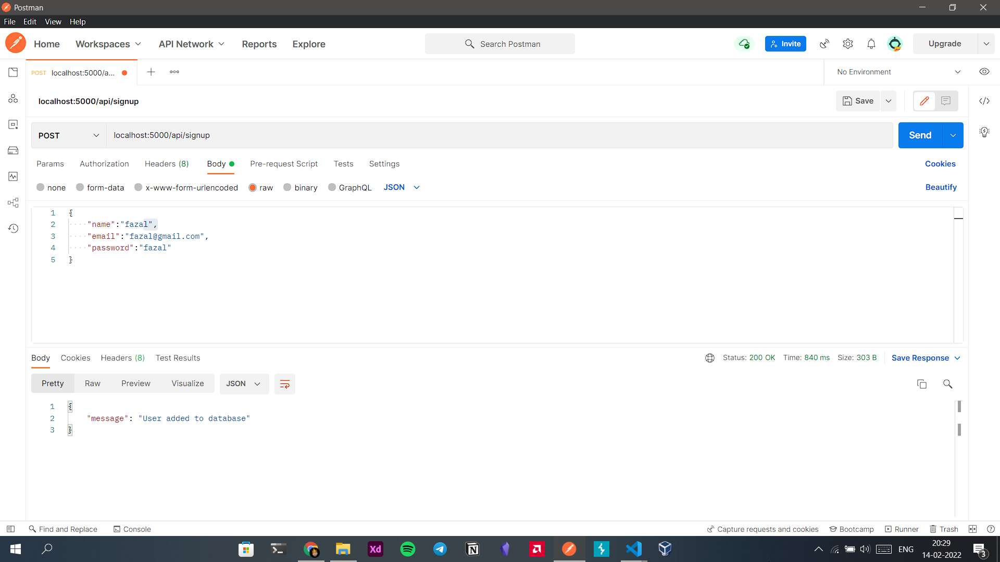
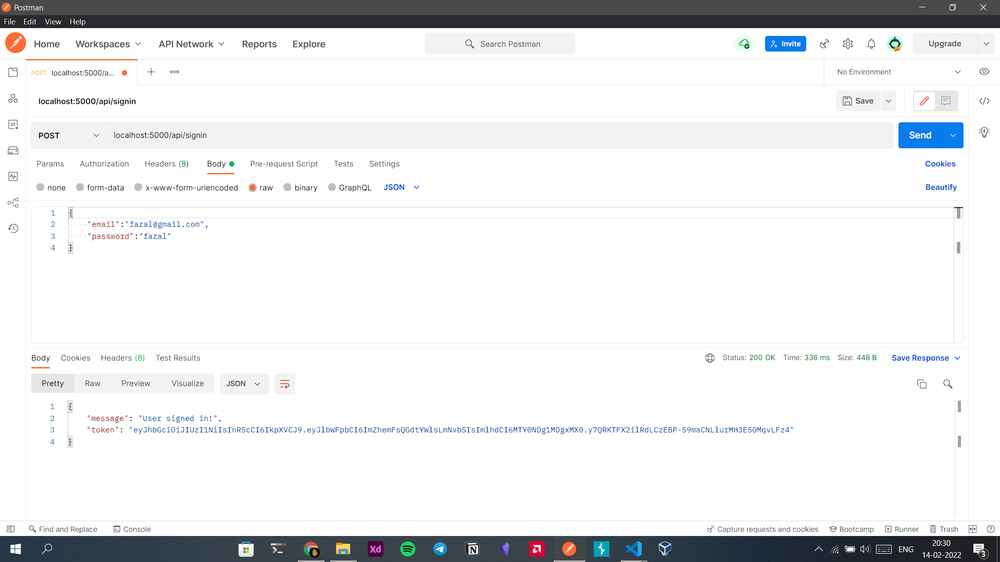

# Login
Sign-in, Sign-up backend
## How to request
### /api/signup - url 

### /api/signin - url 

 **IMPORTANT**
 create .env file in home directory and add the following
 `DB_URL=xxxxxdb_urlxxxxx \n
 SECRET_KEY=anything you want here
 `
### Technologies Used
- express
- bcrypt
- cors
- jsonwebtoken
- http-errors
- dotenv
- knex
